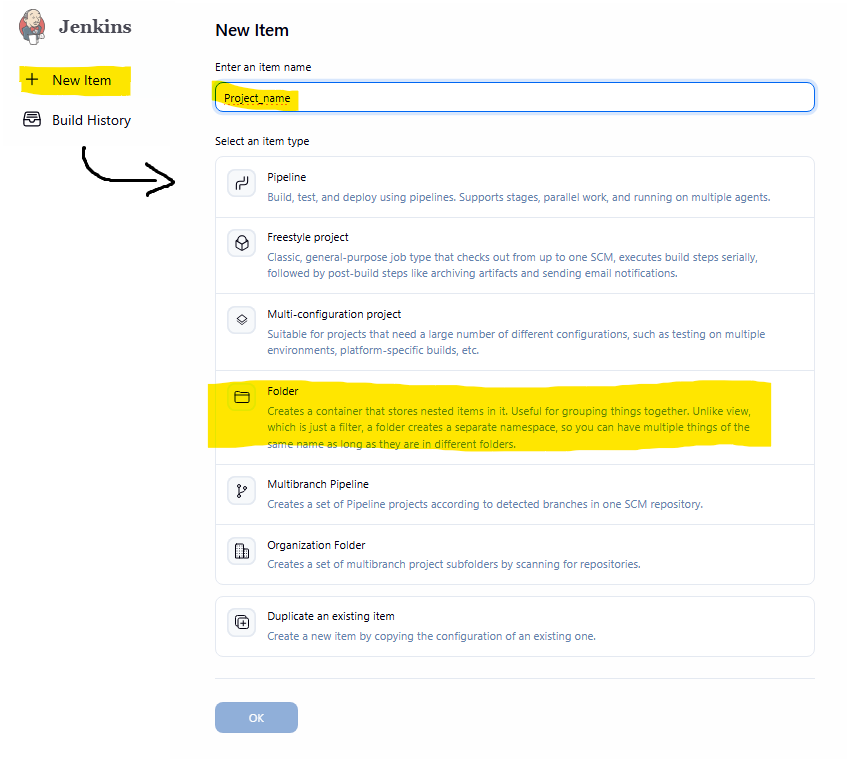
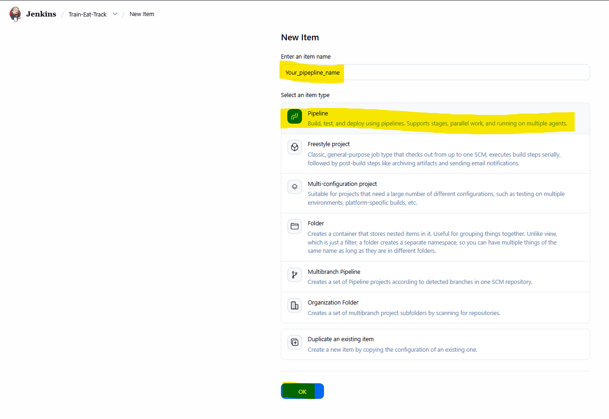
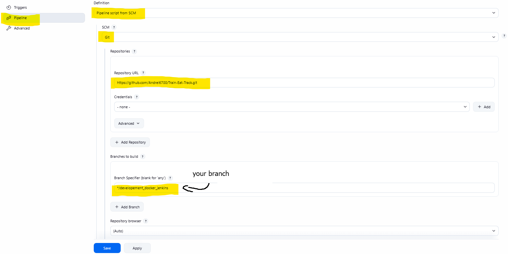
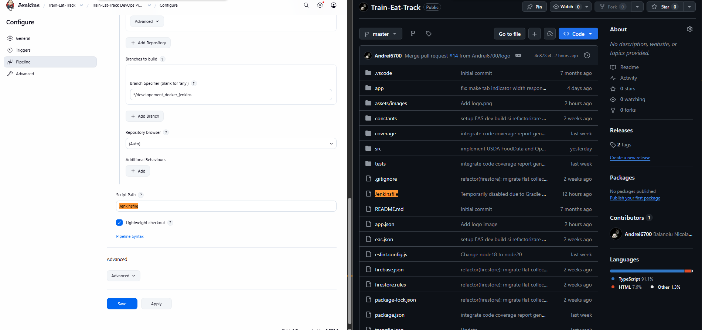

# DevOps & CI/CD Pipeline

This document describes the Continuous Integration and Continuous Delivery (CI/CD) pipeline used in the **Train-Eat-Track** project for automating the build and test process.

---

## Prerequisites

To run the pipeline locally or on the server, you need:

1.  **Docker Desktop** installed and running.
    *   [Docker Installation Guide for Windows](https://docs.docker.com/desktop/setup/install/windows-install/)
2.  **Jenkins** running in a Docker container or installed locally.

---

## Step-by-Step Jenkins Configuration Guide

Follow these steps to configure the pipeline on your Jenkins server:

### Step 1: Create a dedicated folder
To keep the server organized, create a folder for your project:

### Step 2: Create a new Pipeline item
In the newly created folder, create a new **Pipeline** job:

### Step 3: Configure Pipeline Source (Pipeline Script from SCM)
Go to the **Pipeline** section in the job configuration and select:
*   **Definition:** *Pipeline script from SCM*
*   **SCM:** *Git*
*   **Repository URL:** URL of your GitHub repository.

### Step 4: Specify Jenkinsfile Path
Ensure the script path (**Script Path**) exactly matches the filename in the project root:
*   **Script Path:** `Jenkinsfile`

---

## Pipeline Structure (Jenkinsfile)

The pipeline is defined declaratively in the `Jenkinsfile` in the project root and includes the following automatic stages:

1.  **Checkout:** Cloning and downloading the code from the Git repository.
2.  **Install Dependencies:** Running the Node.js package installation process (`npm install`).
3.  **Linter & Tests:** Code syntax validation and running the unit test suite to ensure code quality before the build.
4.  **Build Android Release:** Compiling the production APK/AAB package.
